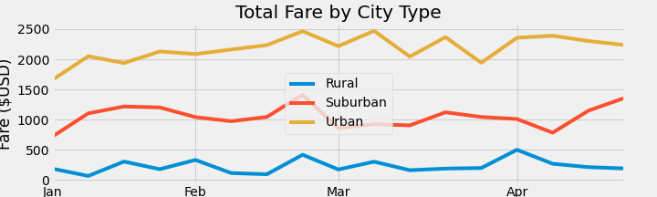

# PyBer_Analysis

The purpose of the new analysis is to see the difference of total fare per week among different types of city during a time period between 2019-01-01 and 2019-04-28.

The result is Urban has the highest total fare and Suburban comes the next and Rural the last, which is kind of expected...
